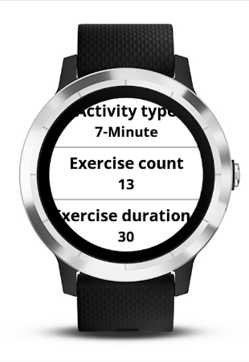

# 7-Minute Workout (HICT) #

## Description ##

[7-Minute Workout (HICT)](https://apps.garmin.com/en-US/apps/65a44a9d-465d-4e76-a866-c0667e51cf98) application for Garmin watches.

This watch application drives you through the execution of 13 exercises as described in the article from ACSM'S Health & Fitness Journal:
_[High-Intensity Circuit Training Using Body Weight: Maximum Results With Minimal Investment](http://journals.lww.com/acsm-healthfitness/Fulltext/2013/05000/HIGH_INTENSITY_CIRCUIT_TRAINING_USING_BODY_WEIGHT_.5.aspx)_.

The watch displays a timer for the 30-second exercises followed by 10-second rest period. Duration of exercise and rest periods is configurable through Garmin Connect Mobile.

The application supports heart-rate monitor (HRM) and temperature sensor (Tempe).

If you achieve at least 6 exercises, the activity is recorded as a training activity in your Garmin profile.

The activity in your Garmin profile will include basic information such as date, time, total activity time.

 * Rest periods corresponds to pauses in the activity.
 * Each exercise corresponds to a lap.
 * Calories will be automatically calculated if a heart-rate monitor is used.
 * Heart-rate graph if a heart-rate monitor is used.
 * Temperature graph if a temperature sensor is used.

## Installation ##

Install from Garmin's [Connect IQ Store](https://apps.garmin.com/en-US/apps/65a44a9d-465d-4e76-a866-c0667e51cf98) or from Garmin Connect Mobile.

## Support ##

Please submit questions, issues and enhancement requests on this project's [issue tracker](https://bitbucket.org/obagot/connectiq-hict/issues).

Supported languages: English, French.

Supported models: vívoactive®, vívoactive® HR, Forerunner® 920XT, 630, 235, 230, epix™.

## Development ##

Source code is made available under the [MIT license](https://opensource.org/licenses/MIT).

Pull requests and translations are welcomed!

When [forking](https://bitbucket.org/obagot/connectiq-hict/fork), please remember to change the application ID in *manifest.xml*, to prevent issues between both applications on the watch.

## History ##

7-min is tested on Garmin vívoactive® running Connect IQ 1.2.6.

### v.1.2 - 2016-05-07

* Added short vibration every 10 seconds
* Changed text color: green for current exercise, orange for next exercise
* Added support for vívoactive® HR, Forerunner® 920XT, 630, 235, 230, epix™
* Added second side plank exercise
* Fixed reset of period time when activity stopped

### v.1.1 - 2016-02-10

* Added confirmation dialog when stopping an active session.
* Upgrade to Connect IQ SD 1.2.4.

### v.1.0 - 2016-01-31

* First public release.