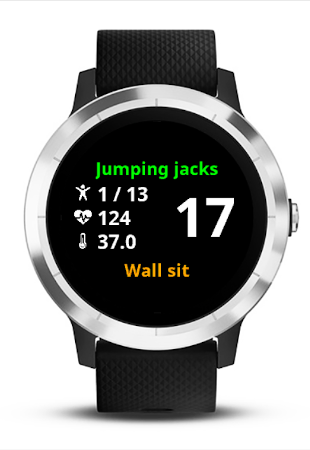
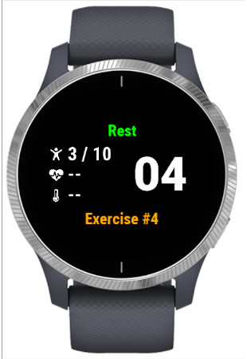

# 7-Minute Workout (HICT) #

## Description ##

7-Minute Workout (HICT) application for Garmin watches.

This watch application drives you through the execution of 12 exercises as described in the article from ACSM'S Health & Fitness Journal:
_[High-Intensity Circuit Training Using Body Weight: Maximum Results With Minimal Investment](http://journals.lww.com/acsm-healthfitness/Fulltext/2013/05000/HIGH_INTENSITY_CIRCUIT_TRAINING_USING_BODY_WEIGHT_.5.aspx)_.

The watch displays a timer for the 30-second exercises followed by 10-second rest period. Duration of exercise and rest periods is configurable through Garmin Connect Mobile.

The activity is recorded as a training activity in your profile. Each exercise corresponds to a lap.

The application supports heart-rate monitor and temperature sensor.

Supported languages: English, French.

Supported models: vívoactive.

## History ##

7-min is tested on Garmin vívoactive running Connect IQ 1.2.3.