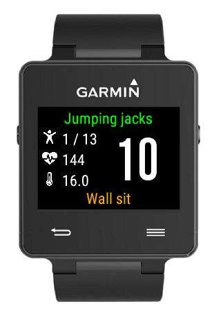

# 7-Minute Workout (HICT) #

## Description ##

[7-Minute Workout (HICT)](https://apps.garmin.com/en-US/apps/65a44a9d-465d-4e76-a866-c0667e51cf98) application for Garmin watches.

This watch application drives you through the execution of 13 exercises as described in the article from ACSM'S Health & Fitness Journal:
_[High-Intensity Circuit Training Using Body Weight: Maximum Results With Minimal Investment](http://journals.lww.com/acsm-healthfitness/Fulltext/2013/05000/HIGH_INTENSITY_CIRCUIT_TRAINING_USING_BODY_WEIGHT_.5.aspx)_.

The watch displays a timer for the 30-second exercises followed by 10-second rest period (configurable).

Number of exercises, duration of exercises and rest periods are configurable on the watch menu or through Garmin Connect Mobile.
A long vibration will trigger at the beginning and at the end of each exercise.
A short vibration will trigger every 10 seconds during the exercise.
Sound notification is not supported.

Three activity types are available:

 - 7-minute workout: 13 exercises from HICT program are repeated, activity is saved as cardio training
 - Cardio: activity is saved as cardio training
 - Strength: activity is saved as strength training

The application supports heart-rate monitor (HRM) and temperature sensor (Tempe).

Use the menu button to configure:

 - Activity type
 - Number of exercises
 - Duration of exercise, in seconds
 - Duration of rest period, in seconds

If you achieve at least half of the session, the activity is recorded in your Garmin profile.

The activity in your Garmin profile will include basic information such as date, time, total activity time.

 - Each exercise and rest period corresponds to a lap.
 - Heart-rate graph is included if a heart-rate monitor is used.
 - Temperature graph is included if a temperature sensor is used.
 - Calories will be automatically calculated if and only if a heart-rate monitor is used.

## Installation ##

Install from Garmin's [Connect IQ Store](https://apps.garmin.com/en-US/apps/65a44a9d-465d-4e76-a866-c0667e51cf98) or from Garmin Connect Mobile.

## Support ##

Please submit questions, issues and enhancement requests on this project's [issue tracker](https://bitbucket.org/obagot/connectiq-hict/issues).

Supported languages: Danish, English, French.

Supported models: vívoactive®, vívoactive® HR, Forerunner® 920XT, 735XT, 630, 235, 230, fēnix® 3, fēnix® 3 HR, fēnix® Chronos.

## Development ##

Source code is made available under the [MIT license](https://opensource.org/licenses/MIT).

Pull requests and translations are welcomed!

When [forking](https://bitbucket.org/obagot/connectiq-hict/fork), please remember to change the application ID in *manifest.xml*, to prevent issues between both applications on the watch.

## History ##

7-min is tested on Garmin vívoactive®.

### v.1.11 - 2017-01-03

* Added support for Forerunner® 735XT, fēnix® Chronos.
* Upgrade to Connect IQ SDK 2.2.2.

### v.1.10 - 2016-11-10

* Add menu to configure settings directly from the watch.
* Add configuration for number of exercises.
* Add configurable activity type: 7-minute, cardio training or strength training.
* Upgrade to Connect IQ SDK 2.1.5.

### v.1.9 - 2016-10-15

* Change activity type from strength training to cardio training.
* Upgrade to Connect IQ SDK 2.1.3.
* Remove epix™ support.

### v.1.8 - 2016-08-23

* Upgrade to Connect IQ SDK 2.1.2.

### v.1.7 - 2016-06-13

* Add Danish support, thanks to Anonymous.

### v.1.6 - 2016-06-10

* Fix display issue on Forerunner® 920XT.
* Upgrade to Connect IQ SDK 1.2.9.

### v.1.5 - 2016-05-15

* Fix issue with HRM sensor detection
* Add support for temperature sensor (Tempe) back

### v.1.4 - 2016-05-14

* Removed temporarily support for temperature sensor (Tempe)

### v.1.3 - 2016-05-09

* Added support for fēnix® 3 and fēnix® 3 HR
* Rest time is now included in workout session as lap

### v.1.2 - 2016-05-07

* Added short vibration every 10 seconds
* Changed text color: green for current exercise, orange for next exercise
* Added support for vívoactive® HR, Forerunner® 920XT, 630, 235, 230, epix™
* Added second side plank exercise
* Fixed reset of period time when activity stopped

### v.1.1 - 2016-02-10

* Added confirmation dialog when stopping an active session.
* Upgrade to Connect IQ SD 1.2.4.

### v.1.0 - 2016-01-31

* First public release.